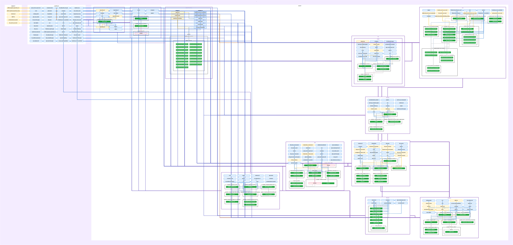

# Private GCP Platform with Terraform

I built this repository to stand up a private-by-default GCP platform that is practical to run, easy to reason about, and straightforward to reproduce across environments.

The end result is a modular Terraform codebase that gives me:

- private networking by default
- a private GKE cluster
- private Cloud SQL
- a bastion host for operator access
- Cloud Run for serverless workloads
- a global HTTPS load balancer as the public edge
- Secret Manager + External Secrets Operator for secret delivery
- a choice between a self-managed NFS VM and Filestore for shared storage
- separate Terraform roots for `dev`, `staging`, and `prod`

This is not trying to be the cheapest possible setup, and it is not trying to be an over-engineered enterprise platform either. The goal is a balanced design that is:

- **private**
- **cost-aware**
- **replicable**
- **auditable**

---
## Architecture visualization


### Viewing the diagram on your computer 
- for ease of access, you can clone the repository locally, then use the following command to see an interactive architectural diagram: 
``` # Pull and run via Docker
docker run --rm -it -p 9000:9000 \
  -v $(pwd):/src \
  im2nguyen/rover:latest \
  -planJSONPath /src/plan.json
```


## What this repository does

This repository provisions a private application platform on Google Cloud using Terraform.

At a high level, each environment deploys:

- a custom VPC and private subnet
- Cloud NAT for controlled outbound access
- firewall rules for internal traffic, IAP SSH, GKE, PostgreSQL, and NFS
- IAM roles and service accounts
- Cloud SQL PostgreSQL over private networking
- a private GKE cluster with private nodes and a private control plane
- nginx ingress in GKE
- External Secrets Operator in GKE
- Cloud Run for serverless application delivery
- a global external HTTPS load balancer with a Google-managed certificate
- a bastion VM for operator access
- network fileshare through either:
  - a dedicated NFS VM, or
  - Filestore

---

## Why I structured it this way

### Private by default
The default stance here is that infrastructure should not be publicly reachable unless there is a clear reason for it to be.

That is why:

- GKE nodes are private
- the GKE control plane uses a private endpoint
- Cloud SQL uses private networking
- the bastion has no public IP
- storage backends stay inside the VPC

The public internet-facing edge is the load balancer, and that is intentional.

### Human access and machine access are separated
I do not want a permanently over-privileged VM sitting inside the VPC.

So:

- the bastion VM service account is low privilege
- operators access the bastion through Cloud IAP + OS Login
- once on the bastion, operators authenticate as themselves and use their own IAM permissions

That is a much cleaner trust model than treating the bastion as a magic admin box.

### Secrets are not pushed through Terraform into Kubernetes
Database secrets are generated and stored in Secret Manager.

In GKE, External Secrets Operator reads from Secret Manager and creates the runtime Kubernetes Secret the workloads need. That avoids the older and weaker pattern of writing secret payloads into Terraform-managed `kubernetes_secret` resources.

### CI/CD does not rely on long-lived service account keys
Bitbucket uses Workload Identity Federation instead of a downloaded JSON service account key.

That matters because long-lived keys are one of the easiest ways to quietly weaken an otherwise solid platform.

### Storage is a conscious tradeoff, not an accident
I support two storage modes:

- **NFS VM** when I want to keep cost down and I am okay owning the storage VM
- **Filestore** when I want a cleaner managed storage story

The code supports both because cost and operational maturity are not always the same in every environment.

### Environments are isolated on purpose
The repository is split into separate Terraform roots:

- `envs/dev`
- `envs/staging`
- `envs/prod`

Each environment has its own backend prefix, variables, and example tfvars. Shared logic stays in `modules/`.

That makes the platform much easier to reason about and much safer to operate than one giant root with a pile of conditional variables.

---

## Architecture

### Public edge
The public edge is a **global external HTTPS load balancer**.

It terminates TLS using a **Google-managed certificate** and routes requests based on hostname to:

- **GKE nginx ingress** for cluster-served hosts
- **Cloud Run** for serverless-served hosts

This keeps certificate handling out of the repository and avoids shipping private key material around.

### Network
Each environment gets its own:

- VPC
- private subnet (non-overlapping ranges so you may perform VPC peering in the future if need be)
- private service networking range
- router
- Cloud NAT IP(s)

Cloud NAT gives me predictable egress, which is useful when I need to whitelist outbound access in external systems.

### Kubernetes
GKE is configured as:

- private nodes
- private control plane endpoint
- Workload Identity enabled
- dedicated node pool
- nginx ingress via Helm
- External Secrets Operator via Helm

The private control plane is one of the biggest security wins in the repo, but it also creates an operational tradeoff that I call out below.

### Database
Cloud SQL PostgreSQL is configured with:

- private IP only
- encrypted connections
- backups enabled
- point-in-time recovery support
- generated credentials stored in Secret Manager

### Bastion
The bastion is small, private, and snapshot-backed.

It is there to give me a controlled operator entry point into the VPC, especially for environments where Cloud Shell or a public laptop cannot directly reach private services.

### Storage
If `use_filestore = false`, the environment provisions:

- a dedicated NFS VM
- a persistent data disk
- snapshot schedules for both the boot disk and the data disk

If `use_filestore = true`, the environment provisions:

- a Filestore instance instead

---

## GKE tradeoff: private control plane

The biggest tradeoff in this repository is the GKE control plane.

I made the cluster private because it is the right choice for a secure platform, but it comes with a real operational implication:

**Terraform operations that interact with Kubernetes or Helm must run from somewhere that can reach the private GKE endpoint.**

That means:

- applying raw GCP resources can often be done from a normal Terraform runner
- applying Kubernetes, Helm, or `kubernetes_manifest` resources must be done from:
  - the bastion, or
  - another runner that has private network access into the VPC

I consider this a good tradeoff.

It is slightly less convenient, but it is a much better security posture than exposing the control plane publicly just to make Terraform easier to run.

---

## Why I consider this good practice for private infra

### Replicable
Everything important is declared in Terraform and split into reusable modules.

The environment roots are thin and mostly just provide:

- state location
- sizing
- IP ranges
- hostnames
- environment-specific choices like NFS vs Filestore

That makes it easy to reproduce the same design across dev, staging, and prod without copy-pasting entire stacks.

### Auditable
The infrastructure is auditable because:

- IAM is declared in code
- firewall intent is declared in code
- secret delivery flow is declared in code
- storage mode is explicit in code
- environment differences are visible in `terraform.tfvars`

This is exactly the kind of setup where a reviewer can diff a change and understand what is actually going to happen.

### Cost-effective
I intentionally kept a few cost-aware choices in the design:

- a small bastion VM
- optional NFS VM for lower-cost environments
- Filestore only when I explicitly want the managed storage path
- Cloud Run for serverless workloads where that makes sense

This is not “minimum spend at all costs,” but it is realistic. I am not forcing premium managed services everywhere when a simpler option is good enough for dev or staging.

### Best practice without pretending every environment is the same
A lot of Terraform repos either:

- go too cheap and ignore security/operability, or
- go too idealized and become expensive and awkward to run

I tried to stay in the middle:

- private by default
- managed where it matters most
- cost-aware where it is reasonable
- separate environments
- minimal long-lived credentials
- reproducible and reviewable changes

---

## Repository layout

```text
├── envs
│   ├── dev
│   │   ├── main.tf
│   │   ├── outputs.tf
│   │   ├── terraform.tfvars_example
│   │   └── variables.tf
│   ├── prod
│   │   ├── main.tf
│   │   ├── outputs.tf
│   │   ├── terraform.tfvars_example
│   │   └── variables.tf
│   └── staging
│       ├── main.tf
│       ├── outputs.tf
│       ├── terraform.tfvars_example
│       └── variables.tf
├── .gitignore
├── LICENSE
├── modules
│   ├── artifact-registry
│   │   ├── artifact-registry.tf
│   │   ├── outputs.tf
│   │   └── variables.tf
│   ├── bastion
│   │   ├── bastion.tf
│   │   ├── outputs.tf
│   │   ├── startup_bastion.sh
│   │   └── variables.tf
│   ├── cr
│   │   ├── cr.tf
│   │   ├── outputs.tf
│   │   └── variables.tf
│   ├── filestore
│   │   ├── filestore.tf
│   │   ├── outputs.tf
│   │   └── variables.tf
│   ├── firewall
│   │   ├── firewall.tf
│   │   ├── outputs.tf
│   │   └── variables.tf
│   ├── gke
│   │   ├── deployment.yaml
│   │   ├── gke.tf
│   │   ├── outputs.tf
│   │   ├── routes_test_deployment.yml
│   │   ├── values.yaml
│   │   └── variables.tf
│   ├── iam
│   │   ├── iam.tf
│   │   ├── outputs.tf
│   │   └── variables.tf
│   ├── lbs
│   │   ├── lb.tf
│   │   ├── outputs.tf
│   │   └── variables.tf
│   ├── nfs
│   │   ├── nfs.tf
│   │   ├── outputs.tf
│   │   ├── startup_nfs.sh
│   │   └── variables.tf
│   ├── sql
│   │   ├── outputs.tf
│   │   ├── sql.tf
│   │   └── variables.tf
│   └── vpc
│       ├── outputs.tf
│       ├── variables.tf
│       └── vpc.tf
└── README.md


```

---

## Module overview

### `modules/vpc`
Creates the per-environment VPC, private subnet, private service networking range, router, NAT IPs, Cloud NAT, and global LB IP.

### `modules/firewall`
Defines the network access model for:

- internal ICMP
- internal web traffic
- internal app traffic on `8080`
- GKE to PostgreSQL on `5432`
- load balancer to nginx on `80`
- IAP SSH to the bastion on `22`
- GKE to NFS on `2049` when NFS mode is enabled

### `modules/iam`
Defines:

- low-privilege service accounts for bastion and NFS
- GKE Cloud SQL service account
- External Secrets Operator service account
- Bitbucket custom role and Workload Identity Federation
- bastion human access bindings
- optional frontend custom role binding

### `modules/sql`
Builds a Cloud SQL PostgreSQL instance, creates the application database and user, generates the password, and stores the DB credentials in Secret Manager.

### `modules/bastion`
Builds the bastion VM, its dedicated boot disk, and a snapshot schedule for recovery.

### `modules/nfs`
Builds the NFS VM, dedicated boot and data disks, snapshot schedule, and boot-time NFS export configuration.

### `modules/filestore`
Builds a Filestore instance when I choose the managed storage path.

### `modules/gke`
Builds the private GKE cluster and node pool, configures Workload Identity, installs nginx ingress and External Secrets Operator, and creates the SecretStore / ExternalSecret resources used for database secret delivery.

### `modules/cr`
Builds the Cloud Run service and Artifact Registry repository.

### `modules/lbs`
Builds the managed SSL certificate, serverless NEG for Cloud Run, GKE backend service, health check, URL map, HTTPS proxy, and forwarding rule.

---

## Environments

The deployable roots are:

- `envs/dev`
- `envs/staging`
- `envs/prod`

Each environment has:

- its own backend prefix
- its own variable declarations
- its own example tfvars
- its own outputs

### General intent per environment

#### Dev
I keep dev cheaper and more flexible.

Typical choices:

- smaller VM sizes
- smaller GKE footprint
- NFS VM instead of Filestore
- easier experimentation

#### Staging
Staging is meant to be closer to production without being as expensive.

Typical choices:

- slightly larger compute
- more realistic autoscaling and storage sizing
- still flexible enough to test change safely

#### Prod
Prod is where I lean harder into resilience and stronger operational defaults.

Typical choices:

- larger GKE node sizes and counts
- stronger SQL sizing
- Filestore enabled
- stricter deletion posture

---

## How to use this repository

### 1. Create a Terraform state bucket
Before doing anything else, create a GCS bucket for Terraform state.

Then update each environment backend block if needed.

### 2. Choose an environment
Pick one of:

- `envs/dev`
- `envs/staging`
- `envs/prod`

### 3. Create a real tfvars file
Start from the example in that environment.

For example:

```bash
cd envs/dev
cp terraform.tfvars_example terraform.tfvars
```

Then edit:

- project ID
- hostnames
- Bitbucket workspace values
- access groups/users
- CIDR ranges if needed
- storage mode

### 4. Initialize Terraform
```bash
terraform init
```

### 5. Plan
```bash
terraform plan
```

### 6. Apply
```bash
terraform apply
```

---

## Important apply note for private GKE

If the change touches:

- Kubernetes resources
- Helm releases
- External Secrets Operator resources

then Terraform must run from somewhere that can reach the private GKE endpoint.

In practice, that usually means:

- the bastion VM, or
- a runner connected to the VPC

If the change is only about raw GCP resources, that requirement may not apply.

---

## Storage mode selection

### Use the NFS VM when:

- I want to keep cost down
- I am okay with managing a storage VM
- the environment is dev or staging
- I want more control than a managed storage service gives me

### Use Filestore when:

- I want a cleaner managed storage model
- operational simplicity matters more than minimizing spend
- the environment is closer to production expectations

### Toggle
The switch is:

```hcl
use_filestore = false
```

- `false` = NFS VM
- `true` = Filestore

---

## Security model

### Public surfaces
Public access is intentionally limited to the load balancer and the application surfaces behind it.

That means:

- the global HTTPS load balancer is public
- Cloud Run is public-facing through the intended routing path
- GKE ingress is reached through the load balancer

### Private surfaces
These stay private:

- GKE nodes
- GKE control plane endpoint
- Cloud SQL
- bastion
- NFS VM
- Filestore

### Identity and secret handling
- Bitbucket uses Workload Identity Federation
- DB credentials are generated and stored in Secret Manager
- GKE receives secrets via External Secrets Operator
- bastion and NFS service accounts stay low privilege

---

## Backups and recovery assumptions

### Bastion
The bastion boot disk is snapshot-backed. The point of that is to recover the operator entry point into the environment, not to treat the bastion as a source of truth for stateful app data.

### NFS VM
When I use the NFS VM, both the boot disk and data disk are snapshot-backed. The data disk is the more operationally important one.

### SQL
Cloud SQL backups are enabled and the design expects restore capability to come from the managed database service, not from inventing a custom backup pattern in Terraform.

---

## Why I consider this replicable and auditable

I care a lot about being able to answer simple questions clearly:

- what is public?
- what is private?
- what identity is allowed to do what?
- where do secrets come from?
- how does storage work in this environment?
- what is different between dev, staging, and prod?

This repository answers those questions in code.

That is why I think it is auditable.

And because environments are separate roots with shared modules, I can replicate the platform without cloning and rewriting the whole stack every time.

---

## Caveats and tradeoffs

This is not pretending every choice here is universally perfect.

A few tradeoffs are deliberate:

- private GKE improves security but makes apply paths stricter
- NFS VM is cheaper but less managed than Filestore
- Cloud Run is public-facing by design because it is part of the application edge
- bastion is intentionally simple because it is an operator entry point, not a workload host

I would rather make those tradeoffs explicit than hide them behind vague “best practice” language.

---

## Suggested workflow

For a fresh environment:

1. choose the env root
2. fill in `terraform.tfvars`
3. run `terraform init`
4. run `terraform plan`
5. apply foundational infrastructure
6. use the bastion for private-cluster Terraform operations when required
7. validate app routing through the load balancer

---

## License

This project is licensed under the MIT License. See `LICENSE`.